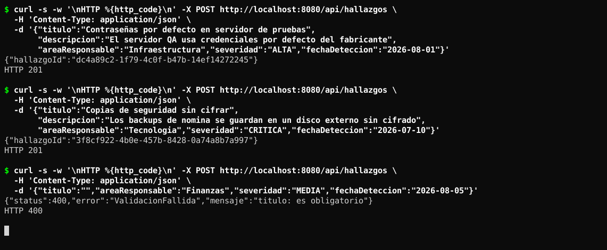
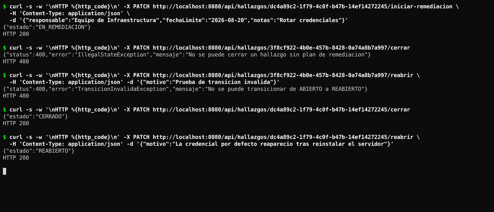
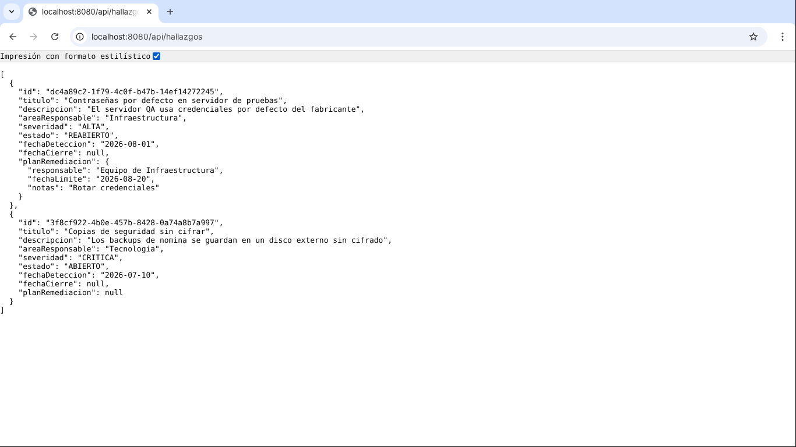
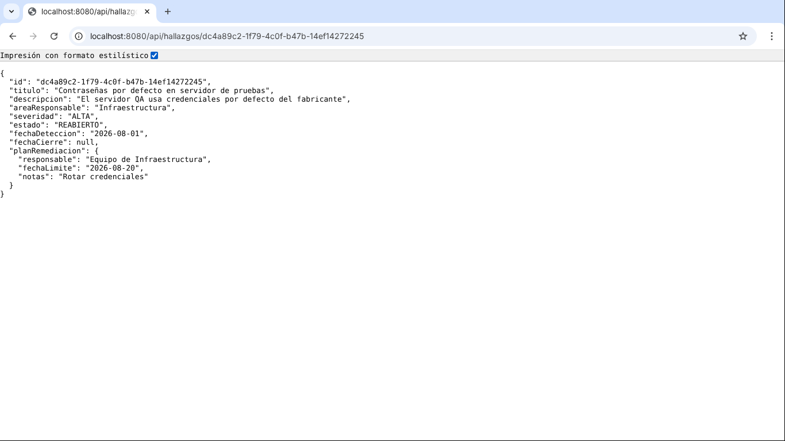
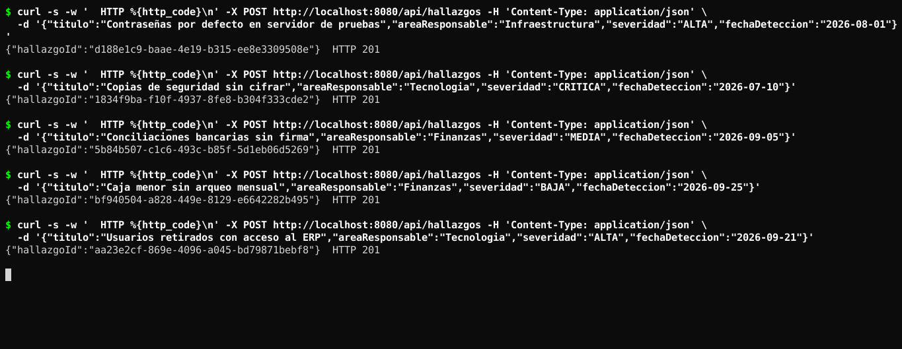
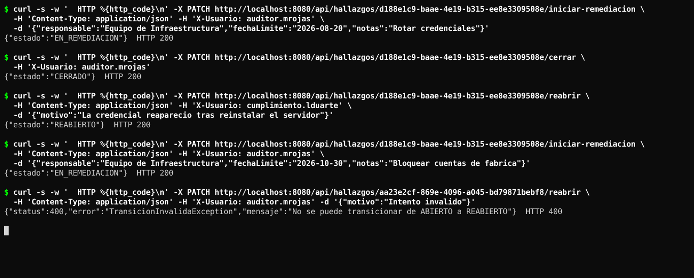
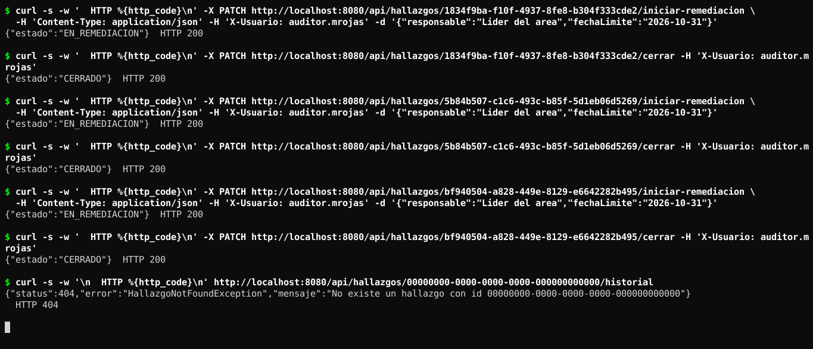
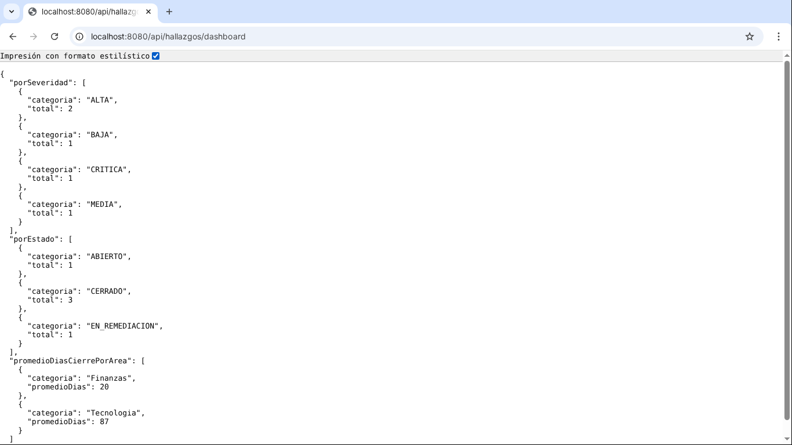
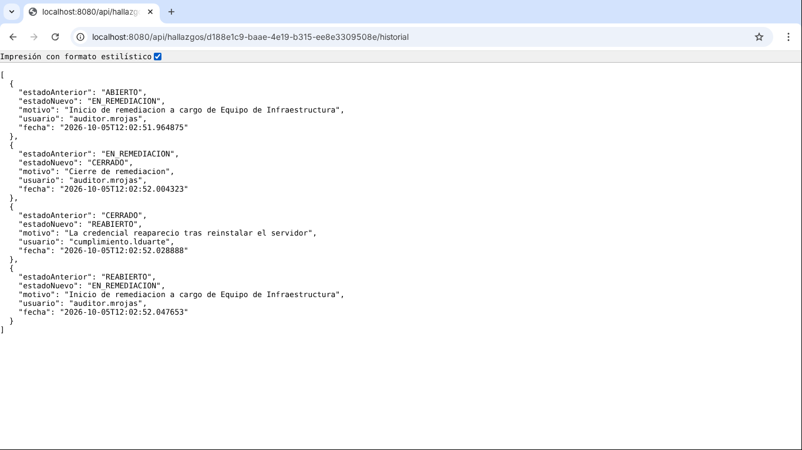

# Post-contenido Unidad 8: Patrones Arquitectónicos II

## Descripción

Repositorio del post-contenido de la Unidad 8 de Patrones de Diseño de Software. Es un sistema de seguimiento de hallazgos de auditoría interna hecho con Clean Architecture sobre Spring Boot (Parte 1) y extendido con un dashboard agregado para el comité de auditoría y una bitácora de trazabilidad de cambios de estado (Parte 2). Las dos partes viven en el mismo proyecto: la Parte 2 no crea otro proyecto, extiende el código de la Parte 1.

- **Estudiante:** Nicolás Andrés Sánchez Villamizar
- **Repositorio:** `sanchez-post1-u8-patrones`

## Parte 1: Clean Architecture (Hallazgos de Auditoría)

El código está organizado en los cuatro círculos y todas las dependencias apuntan hacia adentro, hacia `domain/`:

| Círculo | Paquete | Qué contiene |
|---|---|---|
| Entities | `domain/` | El Aggregate Root [`HallazgoAuditoria`](src/main/java/com/example/auditoria/domain/entity/HallazgoAuditoria.java), la máquina de estados [`EstadoHallazgo`](src/main/java/com/example/auditoria/domain/valueobject/EstadoHallazgo.java) y los Value Objects `HallazgoId`, `Severidad` y `PlanRemediacion`. Java puro, sin ningún framework. |
| Use Cases | `usecase/` | Una interfaz por caso de uso, los puertos de salida en `port/` ([`HallazgoRepositoryPort`](src/main/java/com/example/auditoria/usecase/port/HallazgoRepositoryPort.java) y, desde la Parte 2, [`HistorialAuditoriaPort`](src/main/java/com/example/auditoria/usecase/port/HistorialAuditoriaPort.java)) y las implementaciones en `impl/`. Tampoco importa Spring. |
| Interface Adapters | `adapter/` | Entrada web ([`HallazgoController`](src/main/java/com/example/auditoria/adapter/in/web/HallazgoController.java), DTOs y manejo de errores) y salida de persistencia ([`HallazgoRepositoryAdapter`](src/main/java/com/example/auditoria/adapter/out/persistence/HallazgoRepositoryAdapter.java), [`HistorialAuditoriaAdapter`](src/main/java/com/example/auditoria/adapter/out/persistence/HistorialAuditoriaAdapter.java) y las entidades JPA). |
| Frameworks & Drivers | `config/` + Spring Boot, JPA y H2 | [`AuditoriaConfiguration`](src/main/java/com/example/auditoria/config/AuditoriaConfiguration.java) hace el wiring explícito: crea cada servicio con `new` y le pasa los puertos, por eso los casos de uso no necesitan `@Service` ni `@Transactional`. |

Se puede comprobar que `domain/` y `usecase/` no dependen de ningún framework con este comando, que no devuelve nada:

```
grep -rnE "import (org\.springframework|jakarta\.)" src/main/java/com/example/auditoria/domain src/main/java/com/example/auditoria/usecase
```

### Estructura de paquetes

```
sanchez-post1-u8-patrones/
├── pom.xml
└── src/main/java/com/example/auditoria/
    ├── domain/                              (Entities)
    │   ├── entity/HallazgoAuditoria.java
    │   └── valueobject/
    │       ├── HallazgoId.java
    │       ├── Severidad.java
    │       ├── EstadoHallazgo.java
    │       ├── PlanRemediacion.java
    │       └── TransicionInvalidaException.java
    ├── usecase/                             (Use Cases)
    │   ├── RegistrarHallazgoUseCase.java, IniciarRemediacionUseCase.java,
    │   │   CerrarHallazgoUseCase.java, ReabrirHallazgoUseCase.java,
    │   │   ConsultarHallazgoUseCase.java, HallazgoNotFoundException.java
    │   ├── ObtenerDashboardAuditoriaUseCase.java      (Parte 2)
    │   ├── ConsultarHistorialUseCase.java             (Parte 2)
    │   ├── port/
    │   │   ├── HallazgoRepositoryPort.java            (extendido en la Parte 2)
    │   │   ├── HistorialAuditoriaPort.java            (Parte 2)
    │   │   └── ConteoCategoria, PromedioCategoria, DashboardAuditoriaView, CambioEstadoView
    │   └── impl/ (un Service por caso de uso)
    ├── adapter/                             (Interface Adapters)
    │   ├── in/web/
    │   │   ├── HallazgoController.java
    │   │   ├── ManejadorErroresWeb.java
    │   │   └── dto/
    │   └── out/persistence/
    │       ├── HallazgoJpaEntity.java
    │       ├── HallazgoJpaRepository.java             (proyecciones de la Parte 2)
    │       ├── HallazgoRepositoryAdapter.java
    │       ├── HistorialCambioEstadoJpaEntity.java    (Parte 2)
    │       ├── HistorialCambioEstadoJpaRepository.java (Parte 2)
    │       └── HistorialAuditoriaAdapter.java         (Parte 2)
    ├── config/AuditoriaConfiguration.java   (Frameworks & Drivers)
    └── AuditoriaHallazgosApplication.java
```

```
  adapter (web, persistencia)  ──►  usecase (puertos)  ──►  domain
             ▲
           config  (arma todo con @Bean y le pone la transacción a los casos de uso)
```

## Parte 2: Análisis costo-beneficio de CQRS/Event Sourcing

El comité pidió dos cosas: un dashboard con conteos por severidad y por estado más el promedio de días de cierre por área, y una bitácora que permita reconstruir cada cambio de estado (quién, cuándo, de qué estado a qué estado) sin que se pueda alterar después. Son justo el tipo de requisitos con los que la guía presenta CQRS y Event Sourcing, así que antes de programar respondí las cinco preguntas del Paso 8 con los criterios de las secciones 4.4, 5.5 y 7 de la guía.

**Escala y carga.** Este sistema lo usa, siendo generosos, el comité de auditoría y unos cuantos auditores: menos de diez personas y casi nunca al mismo tiempo. Las escrituras son pocas transiciones al día y la lectura pesada (el dashboard) se pide una vez al mes antes de la reunión. No hay una diferencia de órdenes de magnitud entre lecturas y escrituras, que es lo que la Sección 4.4 pone como señal para separar infraestructura. Lo medí: con 507 hallazgos cargados en H2, `GET /api/hallazgos/dashboard` respondió entre 4 y 8 ms después de la primera llamada. No hay ningún cuello de botella que una base de lectura aparte vaya a resolver.

**Complejidad de las consultas.** Los tres bloques del dashboard son un `COUNT ... GROUP BY severidad`, un `COUNT ... GROUP BY estado` y un `AVG` de días entre `fechaDeteccion` y `fechaCierre` agrupado por área, todo sobre la misma tabla `hallazgos`. No hay joins entre agregados, ni búsqueda de texto, ni datos de otros sistemas. Se resuelven con tres consultas JPQL y proyecciones de interfaz en el [mismo `HallazgoJpaRepository`](src/main/java/com/example/auditoria/adapter/out/persistence/HallazgoJpaRepository.java#L10-L23). Un modelo de lectura con otra tecnología solo se justificaría si estas consultas no se pudieran expresar o fueran lentas sobre el esquema actual, y ninguna de las dos cosas pasa.

**Consistencia.** El comité revisa el dashboard antes de una reunión mensual. Lo que necesita es el estado al momento de pedir el reporte, igual que cualquier reporte generado bajo demanda, y eso es exactamente lo que da una consulta sobre la tabla actual. Con CQRS completo el modelo de lectura se alimenta de forma asíncrona, entonces aparece consistencia eventual: un hallazgo recién cerrado podría no salir todavía en el dashboard. Es decir, separar los modelos no solo no aporta aquí, sino que empeora la consistencia que hoy se tiene gratis por leer de la misma base.

**Naturaleza de la trazabilidad exigida.** Cumplimiento quiere ver la secuencia cronológica de cambios de un hallazgo con quién y cuándo, y que nadie la pueda reescribir. No pidió reconstruir cómo estaba el hallazgo en una fecha pasada ni reproducir eventos para volver a calcular el estado, que es lo que realmente ofrece Event Sourcing (Sección 5.5). Para eso basta una bitácora adicional que conviva con el estado actual: cada transición inserta un registro en la misma transacción que guarda el hallazgo, y el estado sigue saliendo de `hallazgos`.

**Señales de sobre-ingeniería (Sección 7.2).** No hay un experto de negocio disponible para modelar eventos (la organización es ficticia y el ciclo de vida ya está cerrado en cuatro estados y tres transiciones). El equipo soy yo solo y no tengo experiencia previa con Event Sourcing, lo que implica aprender en el mismo entregable versionado de eventos, snapshots y reconstrucción de proyecciones. Y el costo de dos modelos separados (dos esquemas, un mecanismo de sincronización, proyecciones que se pueden desfasar, el doble de pruebas) no es proporcional a un problema que hoy se resuelve con tres consultas y una tabla más. Las tres señales de la guía aparecen.

**Conclusión.** No se justifica CQRS ni Event Sourcing completos para este sistema todavía. Implementé la extensión liviana: el mismo `HallazgoRepositoryPort` con tres métodos de consulta agregada y una bitácora append-only escrita en la misma transacción de cada cambio de estado. Lo que sí haría reconsiderar la decisión está en la sección de conclusiones.

## Decisiones de diseño

### 1. Severidad como enum simple y EstadoHallazgo como enum con máquina de estados

[`EstadoHallazgo`](src/main/java/com/example/auditoria/domain/valueobject/EstadoHallazgo.java#L6-L13) tiene el método `puedeTransicionarA(...)` porque el estado sí tiene una regla de negocio propia: solo existen cuatro transiciones válidas (ABIERTO → EN_REMEDIACION → CERRADO → REABIERTO → EN_REMEDIACION) y cualquier otra debe rechazarse. Si esa regla quedara afuera, por ejemplo en un `if` dentro de cada servicio, se repetiría en tres lugares y bastaría con olvidar uno para permitir cerrar un hallazgo que nunca estuvo en remediación. Al ponerla en el enum, el aggregate la usa en un solo punto ([`transicionar`](src/main/java/com/example/auditoria/domain/entity/HallazgoAuditoria.java#L83-L90)) y la prueba `EstadoHallazgoTest` verifica que de las 16 combinaciones posibles solo 4 son válidas.

[`Severidad`](src/main/java/com/example/auditoria/domain/valueobject/Severidad.java#L3-L5) en cambio es solo una clasificación. Ninguna severidad "pasa" a otra ni restringe lo que se puede hacer con el hallazgo, así que agregarle métodos sería comportamiento inventado sin regla que lo respalde. Si en el futuro la severidad definiera, por ejemplo, un plazo máximo de remediación (CRÍTICA = 15 días), ahí sí tendría sentido darle comportamiento, porque ya habría una regla real que encapsular.

### 2. PlanRemediacion como Value Object embebido y no como agregado separado

La invariante es que un hallazgo no puede estar EN_REMEDIACION sin un plan válido ni cerrarse sin uno ya definido. Según el criterio de límite de consistencia transaccional de la guía (Sección 3.3), todo lo que debe cumplir una invariante al mismo tiempo tiene que vivir dentro del mismo agregado y guardarse en la misma transacción. Si `PlanRemediacion` fuera un agregado aparte con su propio repositorio, guardar el plan y cambiar el estado serían dos operaciones distintas y podría quedar un hallazgo EN_REMEDIACION sin plan si la segunda falla.

Por eso el plan es un `record` inmutable dentro de [`HallazgoAuditoria`](src/main/java/com/example/auditoria/domain/entity/HallazgoAuditoria.java#L61-L75): `iniciarRemediacion(plan)` valida el plan y cambia el estado en la misma llamada, y `cerrar()` revisa que el plan exista antes de transicionar. En la base de datos se guarda en columnas de la misma tabla `hallazgos` (`planResponsable`, `planFechaLimite`, `planNotas`), así que un solo `save` persiste todo el agregado.

### 3. CQRS completo frente a extensión liviana del repositorio existente

Con el análisis anterior (escala mínima, consultas resolubles con `GROUP BY` sobre el mismo esquema, consistencia inmediata que ya se tiene y las señales de la Sección 7) elegí no separar stacks. El [`HallazgoRepositoryPort`](src/main/java/com/example/auditoria/usecase/port/HallazgoRepositoryPort.java#L17-L22) se extendió con `contarPorSeveridad()`, `contarPorEstado()` y `promedioDiasCierrePorArea()`, y el [`HallazgoRepositoryAdapter`](src/main/java/com/example/auditoria/adapter/out/persistence/HallazgoRepositoryAdapter.java) los implementa con las proyecciones de `HallazgoJpaRepository`. Lo que sí tomé de CQRS es la idea de no cargar agregados completos para leer: el dashboard nunca construye objetos `HallazgoAuditoria`, devuelve records de lectura (`ConteoCategoria`, `PromedioCategoria`, `DashboardAuditoriaView`) que están en `usecase/port` y no dependen de JPA. Si algún día hiciera falta un modelo de lectura aparte, el cambio quedaría encerrado en el adaptador porque el caso de uso [`ObtenerDashboardAuditoriaService`](src/main/java/com/example/auditoria/usecase/impl/ObtenerDashboardAuditoriaService.java) solo conoce el puerto.

### 4. Bitácora simple (HistorialCambioEstado) frente a Event Store completo

Un Event Store obligaría a que `HallazgoAuditoria` dejara de guardar su estado y se reconstruyera reproduciendo eventos en cada lectura, o sea reescribir un agregado que ya funciona para resolver una necesidad que Cumplimiento no tiene. Las señales de sobre-ingeniería de la Sección 7.2 aplican directo: no hay experto para modelar eventos, el equipo es de una persona sin experiencia en Event Sourcing y el costo de mantener eventos versionados más proyecciones no es proporcional a "mostrar la lista de cambios".

La bitácora quedó así:

- Cada caso de uso de transición registra el cambio justo después de guardar el hallazgo, usando el estado anterior que ya devuelven los métodos del agregado (por ejemplo [`CerrarHallazgoService`](src/main/java/com/example/auditoria/usecase/impl/CerrarHallazgoService.java#L21-L28)).
- Guardar el hallazgo y escribir la bitácora ocurren en la **misma transacción**. Como `usecase/` no puede importar Spring, la transacción se agrega desde afuera en [`AuditoriaConfiguration.transaccional(...)`](src/main/java/com/example/auditoria/config/AuditoriaConfiguration.java#L74-L84) con un proxy y un `TransactionInterceptor`. Lo verifiqué con el log de `JpaTransactionManager` en DEBUG: al iniciar remediación sale una sola "Creating new transaction ... IniciarRemediacionService.ejecutar", la búsqueda, el guardado del hallazgo y el insert de la bitácora aparecen como "Participating in existing transaction" y hay un solo commit.
- Es **append-only**: [`HistorialCambioEstadoJpaRepository`](src/main/java/com/example/auditoria/adapter/out/persistence/HistorialCambioEstadoJpaRepository.java#L7-L16) extiende `Repository` y no `JpaRepository`, así que solo existen `save` y la búsqueda ordenada, no hay ningún `delete`. La [entidad](src/main/java/com/example/auditoria/adapter/out/persistence/HistorialCambioEstadoJpaEntity.java#L15-L58) no tiene setters, se crea por constructor y todas sus columnas son `updatable = false`, entonces ni siquiera por error Hibernate puede generar un `UPDATE` sobre un registro ya insertado.
- `HallazgoJpaEntity` sigue siendo la única fuente del estado actual; la bitácora nunca se lee para reconstruir el agregado.

### Correcciones al enunciado

Al revisar el enunciado contra su rúbrica y sus checkpoints encontré cosas que no funcionaban tal cual y las corregí:

**Parte 1**

1. **El adaptador reconstruía el hallazgo repitiendo las transiciones.** El `toDomain` de la guía llamaba a `iniciarRemediacion`, `cerrar()` y `reabrir()` para volver a armar el estado. Eso falla con un hallazgo REABIERTO (intenta ir de EN_REMEDIACION a REABIERTO y lanza `TransicionInvalidaException`) y además `cerrar()` pone `fechaCierre = LocalDate.now()` cada vez que se lee, lo que dañaría el promedio de días de la Parte 2. Lo cambié por una fábrica [`HallazgoAuditoria.reconstituir(...)`](src/main/java/com/example/auditoria/domain/entity/HallazgoAuditoria.java#L44-L59) que restaura el estado guardado sin volver a ejecutar reglas, y el [adaptador](src/main/java/com/example/auditoria/adapter/out/persistence/HallazgoRepositoryAdapter.java#L60-L67) la usa.
2. **`ConsultarHallazgoUseCase` devolvía `HallazgoResponse`.** Ese DTO está en `adapter/in/web/dto`, entonces el círculo de Use Cases dependía de un círculo externo y se rompía la regla de dependencia que pide la rúbrica. Ahora el caso de uso [devuelve `HallazgoAuditoria`](src/main/java/com/example/auditoria/usecase/ConsultarHallazgoUseCase.java#L8-L13) y el controller convierte con [`HallazgoResponse.desde(...)`](src/main/java/com/example/auditoria/adapter/in/web/dto/HallazgoResponse.java#L22-L36).
3. **El 400 del checkpoint no tenía quién lo produjera.** La guía pide que cerrar un hallazgo ABIERTO responda 400, pero sin manejador Spring devuelve 500 ante una excepción no controlada. Agregué [`ManejadorErroresWeb`](src/main/java/com/example/auditoria/adapter/in/web/ManejadorErroresWeb.java#L17-L35), que traduce `TransicionInvalidaException`, `IllegalStateException`, `IllegalArgumentException` y los errores de validación a 400, y `HallazgoNotFoundException` a 404.
4. **`iniciarRemediacion` cambiaba el estado antes de validar el plan.** Con un plan nulo el hallazgo quedaba EN_REMEDIACION y después saltaba la excepción. [Validé el plan primero](src/main/java/com/example/auditoria/domain/entity/HallazgoAuditoria.java#L61-L66) para que el agregado nunca quede inválido.
5. **Partes incompletas en la guía:** constructores de los servicios, `HallazgoNotFoundException` (se usa pero no aparece en la estructura, la dejé en `usecase/`), `buscarTodos()` en el adaptador y todos los beans de la configuración.
6. **Validación y nombres explícitos.** La dependencia Validation estaba en el enunciado pero no se usaba, así que los DTOs tienen `@NotBlank`/`@NotNull` con mensajes en español. También dejé `@PathVariable("id")` con nombre explícito y `<parameters>true</parameters>` en el `pom.xml`, para que el controller no dependa de cómo se compile.

**Parte 2**

7. **La consulta del promedio no arrancaba.** Con `AVG(DATEDIFF('DAY', ...))` la aplicación ni siquiera levanta: Hibernate 6 interpreta `DATEDIFF` como su función `timestampdiff` y exige una unidad temporal, no un texto (`Parameter 1 of function 'timestampdiff()' has type 'TEMPORAL_UNIT'`). La dejé como [`AVG(DATEDIFF(DAY, h.fechaDeteccion, h.fechaCierre))`](src/main/java/com/example/auditoria/adapter/out/persistence/HallazgoJpaRepository.java#L18-L23), sin comillas, que además Hibernate traduce al dialecto de cada base y no queda atada a H2.
8. **Faltaba el "quién".** El requisito de Cumplimiento dice quién originó el cambio, pero el `HistorialAuditoriaPort` y el `CambioEstadoView` de la guía solo guardaban estados, motivo y fecha. Agregué el campo `usuario`, que el controller toma del encabezado [`X-Usuario`](src/main/java/com/example/auditoria/adapter/in/web/HallazgoController.java#L37-L38) (si no viene, queda `anonimo`, para que los curl de la guía sigan funcionando igual).
9. **"En la misma transacción" no estaba garantizado.** Los servicios de la guía no tienen `@Transactional` (y no pueden tenerlo sin romper la pureza de `usecase/`), entonces cada `save` iba en su propia transacción. Se resolvió con el proxy transaccional de la decisión 4.
10. **La bitácora de la guía no era realmente append-only.** `HistorialCambioEstadoJpaRepository extends JpaRepository` hereda `delete`, `deleteAll` y compañía, y la entidad tenía setters. Eso contradice el checkpoint de que no exista ningún método que actualice o elimine un registro, así que cambié a `Repository` con solo `save` y la consulta.
11. **`ConsultarHistorialUseCase` no estaba definido.** El controller de la guía lo usa pero no aparece; lo creé con su servicio, que además responde 404 si el hallazgo no existe en vez de devolver una lista vacía.

## Cómo ejecutar

Requisitos: JDK 17 o superior y Maven 3.8+.

```
mvn clean package
mvn spring-boot:run
```

La API queda en `http://localhost:8080/api/hallazgos`. La base es H2 en memoria, así que cada vez que se reinicia la aplicación arranca vacía. Los cambios de estado aceptan el encabezado opcional `X-Usuario` para dejar registrado quién los hizo.

| Método | Ruta | Respuesta esperada |
|---|---|---|
| POST | `/api/hallazgos` | 201 con `hallazgoId` (UUID), 400 si faltan datos |
| PATCH | `/api/hallazgos/{id}/iniciar-remediacion` | 200 y estado EN_REMEDIACION |
| PATCH | `/api/hallazgos/{id}/cerrar` | 200 si tiene plan, 400 si está ABIERTO |
| PATCH | `/api/hallazgos/{id}/reabrir` | 200 si está CERRADO, 400 en otro caso |
| GET | `/api/hallazgos/{id}` | 200 con el hallazgo, 404 si no existe |
| GET | `/api/hallazgos` | 200 con la lista |
| GET | `/api/hallazgos/dashboard` | 200 con conteos por severidad y estado y promedio de días de cierre por área |
| GET | `/api/hallazgos/{id}/historial` | 200 con los cambios en orden cronológico, 404 si no existe |

Ejemplo de transición con usuario:

```
curl -X PATCH http://localhost:8080/api/hallazgos/{id}/cerrar -H "X-Usuario: auditor.mrojas"
```

## Capturas

### Parte 1

**Registro de hallazgos:** dos registros con 201 y un tercero sin título que responde 400 por validación.



**Transiciones de estado:** iniciar remediación (200), cerrar un hallazgo ABIERTO sin plan (400), reabrir uno ABIERTO (400), cerrar el que está en remediación (200) y reabrirlo (200).



**Listado en el navegador:** el primer hallazgo quedó REABIERTO con `fechaCierre` en null y su plan conservado; el segundo sigue ABIERTO porque los intentos inválidos no lo modificaron.



**Consulta por id en el navegador:**



### Parte 2

**Datos de prueba:** cinco hallazgos de tres áreas y cuatro severidades.



**Ciclo completo con usuario:** el primer hallazgo pasa por remediación, cierre, reapertura (hecha por otra persona, `cumplimiento.lduarte`) y una segunda remediación. Al final se intenta reabrir un hallazgo ABIERTO y responde 400.



**Cierres para el dashboard y 404 del historial:** se cierran los hallazgos de Tecnología y Finanzas y se consulta el historial de un id que no existe.



**Dashboard:** 5 hallazgos en total (2 ALTA, 1 BAJA, 1 CRÍTICA, 1 MEDIA; 1 ABIERTO, 3 CERRADO, 1 EN_REMEDIACION). Finanzas promedia 20 días porque sus dos hallazgos se detectaron el 5 y el 25 de septiembre y se cerraron el 5 de octubre (30 y 10 días); Tecnología promedia 87 porque solo tiene cerrado el del 10 de julio. El hallazgo de Infraestructura no entra al promedio porque no está CERRADO.



**Historial del primer hallazgo:** los cuatro cambios en orden, cada uno con su usuario. El intento inválido sobre otro hallazgo no dejó ningún registro.



## Pruebas

En `src/test/java` hay pruebas JUnit 5 que no levantan Spring:

- `HallazgoAuditoriaTest`: instancia el agregado y recorre el ciclo completo, revisa que no se pueda cerrar sin plan ni reabrir un hallazgo abierto y que `reconstituir` respete el estado guardado.
- `EstadoHallazgoTest`: las 16 combinaciones de la máquina de estados.
- `CasosDeUsoHallazgoTest`: los servicios con repositorio y bitácora en memoria; incluye que cada transición agrega exactamente un registro en orden y que una transición fallida no agrega ninguno.
- `ObtenerDashboardAuditoriaServiceTest`: conteos y promedio de días con datos conocidos.

Además está `AuditoriaHallazgosApplicationTests`, que levanta el contexto completo. Todo se ejecuta con `mvn test`.

## Herramientas utilizadas

- Java 17, Spring Boot 3.5, Spring Web, Spring Data JPA, Validation, H2
- Apache Maven, curl, Git, GitHub

## Conclusiones

Lo más útil de la Parte 1 fue ver que la regla de dependencia no se cumple sola: el código de la guía tenía el caso de uso devolviendo un DTO web, y es un error fácil de cometer que solo se nota al revisar los imports por círculo. También quedó claro que la máquina de estados vale la pena justo porque el estado tiene reglas, y que reconstruir un agregado desde la base no debe pasar por sus métodos de negocio. En la Parte 2 lo importante fue decidir con datos y no por el patrón más llamativo: con menos de diez usuarios, consultas de milisegundos y una trazabilidad que es una lista de cambios, CQRS y Event Sourcing completos solo agregaban costo. Reconsideraría la decisión si el dashboard pasara a tener muchos usuarios concurrentes o consultas históricas pesadas que afecten las escrituras, si Cumplimiento pidiera saber cómo estaba un hallazgo en una fecha pasada (ahí sí se necesitaría replay de eventos), o si otros sistemas tuvieran que reaccionar a los cambios de estado, porque en ese caso los eventos dejarían de ser un registro y pasarían a ser la integración.
